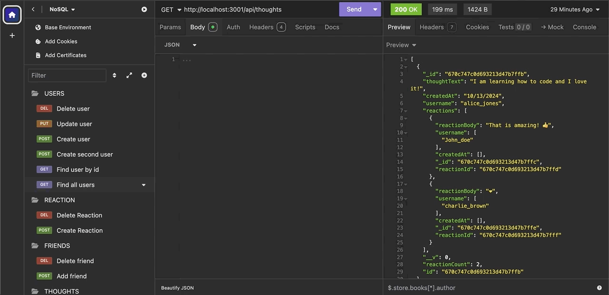
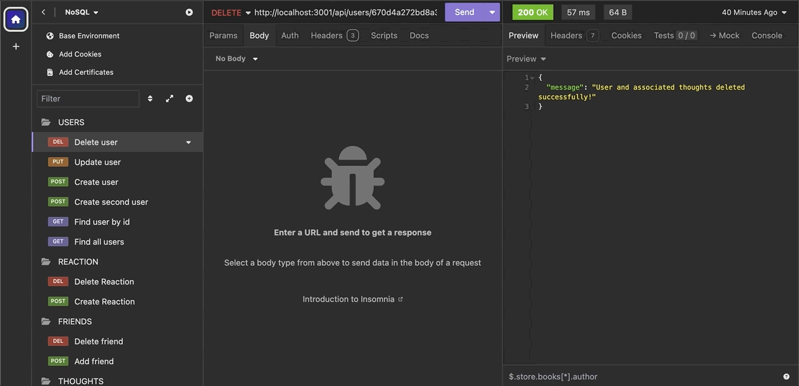
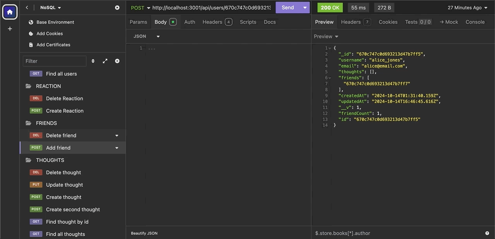

# NoSQL-Social-Network-API


## Table of Contents

- [Technologies Used](#technologies-used)
- [Description](#description)
- [Installation](#installation)
- [Usage](#usage)
- [Tests](#tests)
- [License](#license)
- [Questions](#questions)

## Technologies Used

- **Backend:** Node.js, Express.js, Mongoose
- **Database:** MongoDB
- **Development Tools:** Insomnia (for API testing)

## Description

The Social Network API is a RESTful API built for a social media application that allows users to share their thoughts, react to friends' thoughts, and manage a friend list. This application utilizes a NoSQL database (MongoDB) with Mongoose for data modeling and Express.js for routing. The API enables users to perform CRUD operations on user accounts, thoughts, reactions, and friendships.

## Installation

To set up the Social Network API on your local machine, follow these steps:

1. Clone the repository:
   ```
   git clone https://github.com/yourusername/nosql-social-network-api.git
   cd no-sql-social-network-api
   ```

2. Install the required dependencies:
    ```
    npm install
    ```

3. Run build command and seed:
    ```
    npm run build
    npm run seed
    ```

4. Start the server:
    ```
    npm run start
    ```

API server should now be running on port 3001!

## Usage

Once the server is running, you can test the API endpoints using Insomnia.

## Tests

### API Endpoints

-   User Routes

    -   GET /api/users - Retrieve all users
    -   GET /api/users/:userId - Retrieve a single user by ID
    -   POST /api/users - Create a new user
    -   PUT /api/users/:userId - Update a user by ID
    -   DELETE /api/users/:userId - Delete a user by ID

-   Thought Routes

    -   GET /api/thoughts - Retrieve all thoughts
    -   GET /api/thoughts/:thoughtId - Retrieve a single thought by ID
    -   POST /api/thoughts - Create a new thought
    -   PUT /api/thoughts/:thoughtId - Update a thought by ID
    -   DELETE /api/thoughts/:thoughtId - Delete a thought by ID

-   Friend Routes
    -   POST /api/users/:userId/friends/:friendId - Add a friend to a user's friend list
    -   DELETE /api/users/:userId/friends/:friendId - Remove a friend from a user's friend list

-   Reaction Routes
    -   POST /api/thoughts/:thoughtId/reactions - Add a reaction to a thought
    -   DELETE /api/thoughts/:thoughtId/reactions/:reactionId - Remove a reaction from a thought

The following animation shows GET routes to return all users and all thoughts being tested in Insomnia:



The following animation shows DELETE route to remove a user's associated thoughts when deleted.



The following animation shows the POST and DELETE routes for a user’s friend list being tested in Insomnia:



A walkthrough video that demonstrates the functionality of the social media API:

https://youtu.be/Me-fzcfSYKc

## License

Copyright (c) 2024 ASgithub11

Permission is hereby granted, free of charge, to any person obtaining a copy of this software and associated documentation files (the “Software”), to deal in the Software without restriction, including without limitation the rights to use, copy, modify, merge, publish, distribute, sublicense, and/or sell copies of the Software, and to permit persons to whom the Software is furnished to do so, subject to the following conditions:

The above copyright notice and this permission notice shall be included in all copies or substantial portions of the Software.

THE SOFTWARE IS PROVIDED “AS IS”, WITHOUT WARRANTY OF ANY KIND, EXPRESS OR IMPLIED, INCLUDING BUT NOT LIMITED TO THE WARRANTIES OF MERCHANTABILITY, FITNESS FOR A PARTICULAR PURPOSE AND NONINFRINGEMENT. IN NO EVENT SHALL THE AUTHORS OR COPYRIGHT HOLDERS BE LIABLE FOR ANY CLAIM, DAMAGES OR OTHER LIABILITY, WHETHER IN AN ACTION OF CONTRACT, TORT OR OTHERWISE, ARISING FROM, OUT OF OR IN CONNECTION WITH THE SOFTWARE OR THE USE OR OTHER DEALINGS IN THE SOFTWARE.

## Questions

If you have any questions, reach me on Github: https://github.com/ASgithub11

or email me here at aishasiddiqa151@gmail.com
